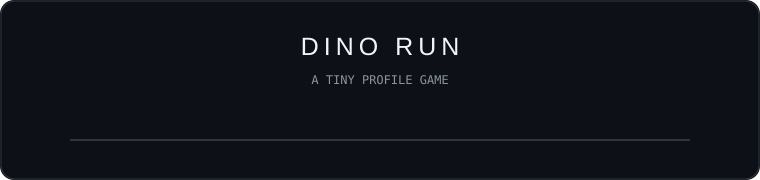
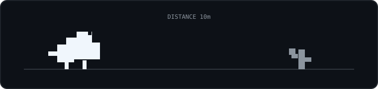
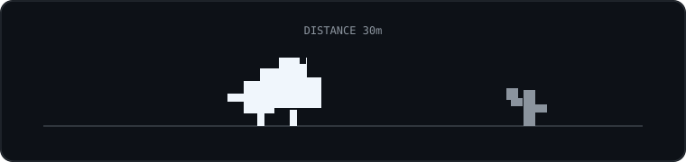
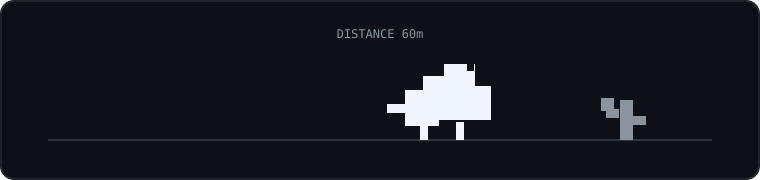
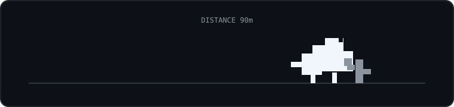
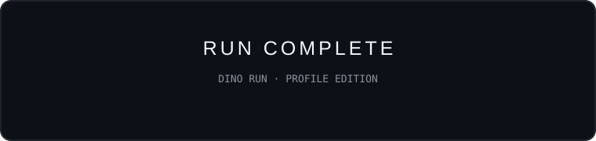
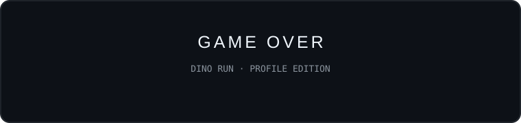

<div align="center">

# This is Zidan.

**Web developer · Linux · Cybersecurity**

[GitHub](https://github.com/zidanshaw) · [Instagram](https://instagram.com/zdn_zaa_) · [Website](https://zidanz.my.id)

</div>

---

## ABOUT

Web developer interested in Linux, cybersecurity, networking, and building useful things.

---

## NOW

| Focus | Work |
|:---|:---|
| **Web** | Frontend development & personal projects |
| **Systems** | Linux, Bash & servers |
| **Security** | Cybersecurity & networking |
| **Experiments** | Small tools, prototypes & technical experiments |

---

## QUOTE OF THE WEEK

<div align="center">

</div>

---

## SELECTED WORK

- **Personal Portfolio** → [zidanz.my.id](https://zidanz.my.id)
- **Project 02** → replace with your project
- **Project 03** → replace with your project

---

## SKILLS

<div align="center">

<table>
<tr>
<td align="center"><br>HTML</td>
<td align="center"><br>CSS</td>
<td align="center"><br>Python</td>
</tr>
<tr>
<td align="center"><br>Bash</td>
<td align="center"><br>Linux</td>
<td align="center"><br>Blender 3D</td>
</tr>
</table>

</div>

---

## LAB

```text
01  Linux
    System customization & experiments

02  Networking
    Servers, routing & connectivity

03  Minecraft
    Self-hosted servers & experiments

04  Web
    Small experiments and prototypes
```

---

## DINO RUN

A tiny profile game built from linked Markdown states.

<div align="center">

<br><br>
**RUN 01 · 0000m**
<br><br>
<a href="#dino-01">START</a>
</div>

---

<a id="dino-01"></a>

### DINO RUN · 0010m

<div align="center"></div>

First obstacle.

[**JUMP**](#dino-02)

---

<a id="dino-02"></a>

### DINO RUN · 0030m

<div align="center"></div>

Clean jump.

[**JUMP**](#dino-03)

---

<a id="dino-03"></a>

### DINO RUN · 0060m

<div align="center"></div>

Speed increasing.

[**JUMP**](#dino-04)

---

<a id="dino-04"></a>

### DINO RUN · 0090m

<div align="center"></div>

One last obstacle.

[**CLEAR**](#dino-win) · [**MISS**](#dino-game-over)

---

<a id="dino-win"></a>

### RUN COMPLETE

<div align="center"></div>

[**RUN AGAIN**](#dino-01)

---

<a id="dino-game-over"></a>

### GAME OVER

<div align="center"></div>

[**TRY AGAIN**](#dino-01)

---

## SOCIALS

[GitHub](https://github.com/zidanshaw) · [Instagram](https://instagram.com/zdn_zaa_) · [Website](https://zidanz.my.id)

<div align="center">`built intentionally`</div>
