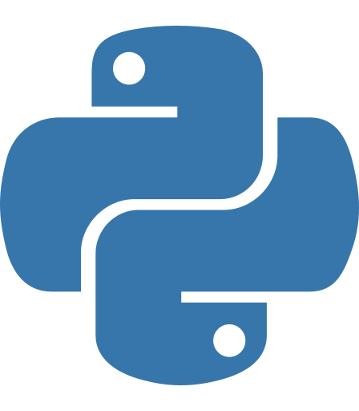

<div align="center">

# This is Zidan.

**Web developer · Linux · Cybersecurity**

[GitHub](https://github.com/zidanshaw) · [Instagram](https://instagram.com/zdn_zaa_) · [Website](https://zidanz.my.id)

</div>

---

## ABOUT

Web developer interested in Linux, cybersecurity, networking, and building things that are actually useful.

I like clean interfaces, lightweight systems, and experiments that teach me something.

---

## NOW

| Area | Focus |
|:---|:---|
| **Web** | Frontend development & personal projects |
| **Systems** | Linux, Bash & servers |
| **Security** | Cybersecurity & networking |
| **Experiments** | Small tools, prototypes & technical experiments |

---

## QUOTE OF THE WEEK

<div align="center">


</div>

---

## SELECTED WORK

<div align="center">

| Project | Preview |
|:---:|:---:|
| **Portfolio** | [View project](https://zidanz.my.id) |
| **Project 02** | [View project](#) |
| **Project 03** | [View project](#) |

</div>

Replace the placeholders with real project or video links. Keep it to a few things worth showing.

---

## SKILLS

<div align="center">

<table>
<tr>
<td align="center" width="120">
<br />
<strong>HTML</strong>
</td>
<td align="center" width="120">
<br />
<strong>CSS</strong>
</td>
<td align="center" width="120">
<br />
<strong>Python</strong>
</td>
</tr>
<tr>
<td align="center" width="120">
<br />
<strong>Bash</strong>
</td>
<td align="center" width="120">
<br />
<strong>Linux</strong>
</td>
<td align="center" width="120">
<br />
<strong>Blender</strong>
</td>
</tr>
</table>

</div>

---

## LAB

```text
01  Linux
    System customization & experiments

02  Networking
    Servers, routing & connectivity

03  Minecraft
    Self-hosted servers & experiments

04  Web
    Small experiments and prototypes
```

---

## PACKET RUNNER

A small networking-themed game.

```text
YOU ARE A PACKET

START
  ↓
ROUTER
  ↓
FIREWALL
  ↓
NETWORK
  ↓
SERVER
```

**Goal:** reach the server while keeping latency low.

[▶ Play Packet Runner](https://zidanz.my.id/packet-runner)

---

## SOCIALS

[GitHub · @zidanshaw](https://github.com/zidanshaw) · [Instagram · @zdn_zaa_](https://instagram.com/zdn_zaa_) · [Website · zidanz.my.id](https://zidanz.my.id)

---

<div align="center">

`built intentionally, not generated`

</div>
